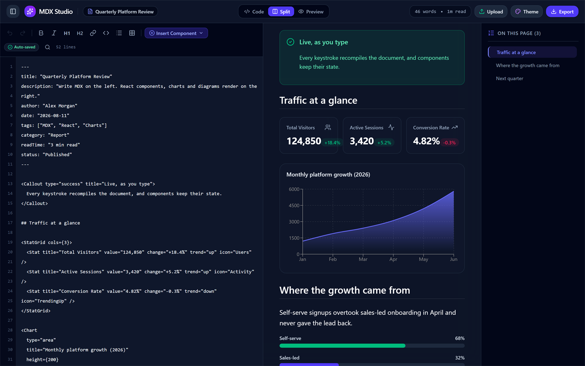
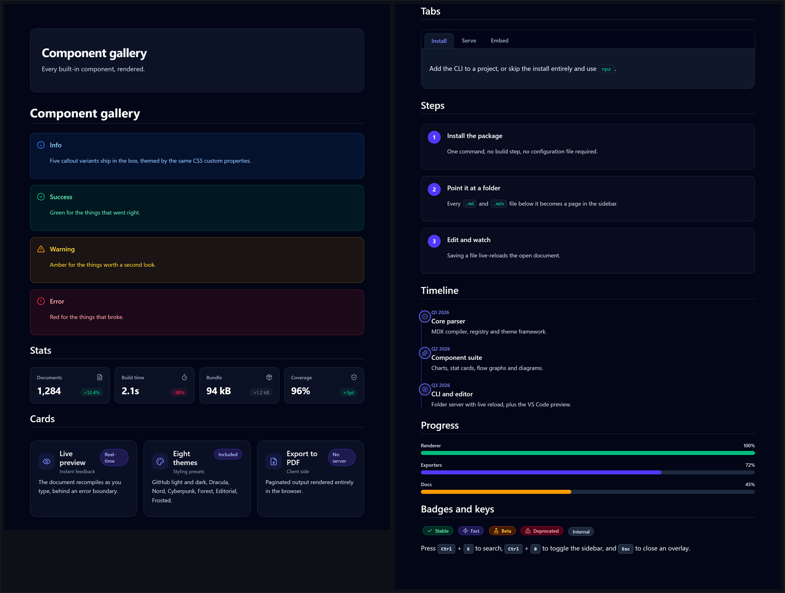
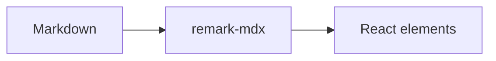
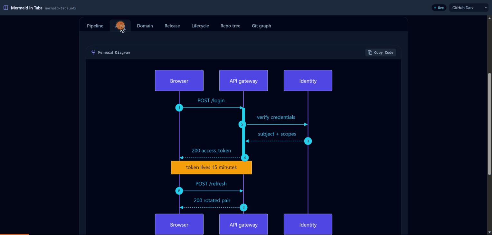
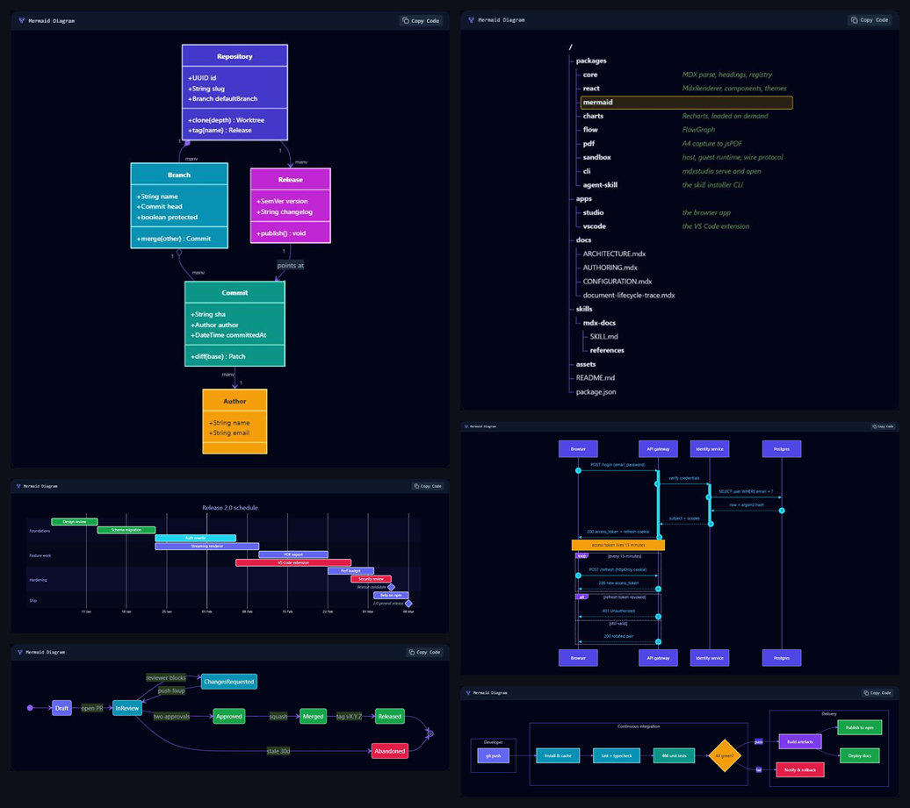
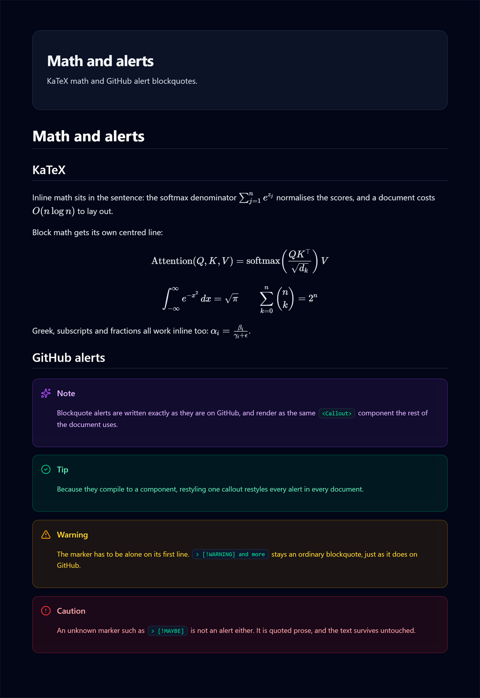
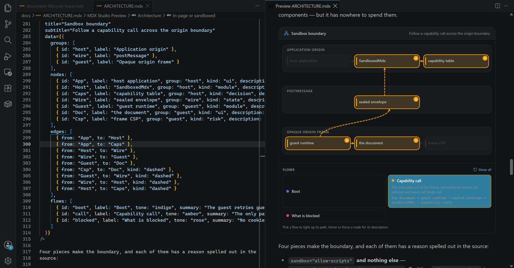
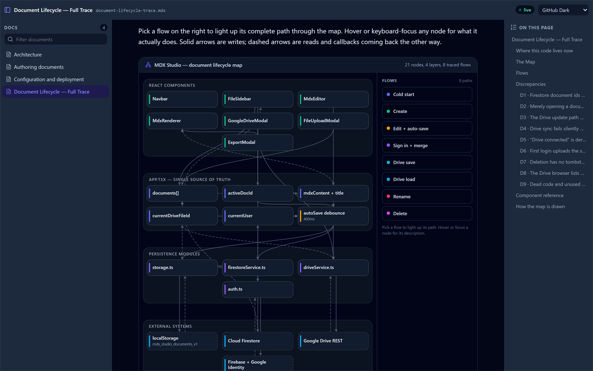
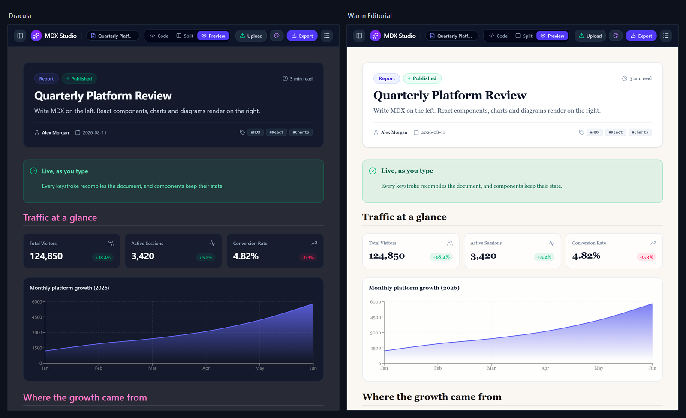

<div align="center">

# mdxstudio

**A React MDX renderer you can drop into an app — and the Studio that proves it works.**

[](https://react.dev)
[](https://www.typescriptlang.org)
[](https://vite.dev)
[](https://docs.npmjs.com/cli/using-npm/workspaces)

[](https://mdxjs.com)
[](https://mermaid.js.org)
[](https://recharts.org)
[](https://firebase.google.com)

[](#)
[](#)
[](#)
[](LICENSE)

</div>

Render MDX in the browser — markdown, real components, Mermaid diagrams, charts,
syntax-highlighted code and YAML frontmatter — either **in the page** or **inside an
isolated iframe** when the document is not yours.

There is **no backend**. Everything — parsing, rendering, PDF generation — runs in the
browser. The server only serves static files.



---

## What you get

Four ways in. Same renderer underneath, so a document that works in one works in all
of them.

| | | |
| --- | --- | --- |
| **The library** | `npm i @mdxstudio/react` | Drop `<MdxRenderer>` into your own app |
| **The Studio** | `npm run dev` | A full editor with live preview, themes and PDF export |
| **The CLI** | `npx @mdxstudio/cli serve ./docs` | Read a folder of documents in your browser, no project required |
| **VS Code** | *MDX Studio Preview* | Preview `.mdx` beside the editor, themed to match it |

### Components you can write straight into a document

No imports, no build step, no config. Every name below is available the moment the
renderer mounts.

```mdx
<Callout type="warning" title="Read this first">
  Braces in prose are parsed as JavaScript. Escape them or lose the paragraph.
</Callout>

<StatGrid cols={3}>
  <Stat title="Bundle" value="2083 kB" change="-4664 kB" trend="down" icon="TrendingDown" />
  <Stat title="Tests" value="320" change="+302" trend="up" icon="CheckCircle2" />
  <Stat title="Packages" value="9" icon="Sparkles" />
</StatGrid>

<Tabs labels={["npm", "pnpm", "yarn"]}>
  <Tab title="npm">`npm i @mdxstudio/react`</Tab>
  <Tab title="pnpm">`pnpm add @mdxstudio/react`</Tab>
  <Tab title="yarn">`yarn add @mdxstudio/react`</Tab>
</Tabs>

<Steps>
  <Step title="Parse">remark-mdx builds the tree, with real source positions.</Step>
  <Step title="Render">hast-util-to-jsx-runtime turns it into React elements.</Step>
</Steps>
```

The full set:

- **Layout** — `Card`, `CardGrid`, `Stat`, `StatGrid`, `Tabs` / `Tab`, `Accordion`,
  `Steps` / `Step`, `Timeline`
- **Emphasis** — `Callout` (`info`, `warning`, `success`, `error`, `note`), `Badge`,
  `Kbd`, `InlineCode`, `Button`, `ProgressBar`
- **Interactive** — `InteractiveCounter`, and any component you register yourself
- **Icons** — any [lucide](https://lucide.dev) name as a string: `icon="Rocket"`.
  Thirty-three common ones are in the bundle; the rest load on demand.



### Diagrams and charts

Each lives in its own package, so a document that never draws a chart never pays for
Recharts.

````mdx


<Chart type="bar" data={[{ name: 'Before', value: 6747 }, { name: 'After', value: 2083 }]} />

<FlowGraph
  nodes={[
    { id: 'edit', label: 'Editor', kind: 'input' },
    { id: 'parse', label: 'remark-mdx' },
    { id: 'view', label: 'Preview', kind: 'output' },
  ]}
  edges={[
    { from: 'edit', to: 'parse', label: 'on change' },
    { from: 'parse', to: 'view' },
  ]}
/>
````

`FlowGraph` is the interactive one — hover a node and it highlights every path
running through it. It lays itself out; you give it nodes and edges, not coordinates.



**Every Mermaid diagram type renders.** All twenty-three in Mermaid 11.16 were
tested against this renderer and none failed to parse — flowcharts, sequence,
class, state, ER, gantt, git graph, mindmap, timeline, journey, pie, quadrant,
requirement, kanban, C4, and the beta types including `treeView` for directory
trees, `sankey`, `xychart`, `block`, `architecture`, `packet`, `radar` and
`treemap`.



Diagrams inside `<Tabs>` work the way you would hope: inactive panels are
unmounted rather than hidden, so each diagram mounts at full width instead of
measuring a zero-width container and laying itself out wrong.

### Frontmatter becomes a header

```mdx
---
title: Release notes
tags: [shipping, v0.1]
---
```

Rendered as a titled card with the tags as pills, not printed as text.

### And the things that are not components

- **Math** — `$E = mc^2$` inline, `$$…$$` as a block, via KaTeX
- **GitHub alerts** — `> [!NOTE]`, `> [!WARNING]` and the rest, which become
  `<Callout>` rather than a parallel style. Sugar for portability: `<Callout>` is
  still the more capable form, with any title you like
- **Syntax highlighting** for fenced code, themed with the document
- **PDF export** that measures real page breaks — no `window.print()`, works on mobile
- **Sandboxed rendering** for a document you did not write: an opaque-origin iframe
  that cannot reach your cookies, your storage or the network



### The other three surfaces

The same renderer, in the editor and on the command line.



*VS Code — `.mdx` previews beside the editor, themed from your colour theme, with
headings in the outline and Ctrl/Cmd+click to jump back to the source.*



*`npx @mdxstudio/cli serve ./docs` — a folder of documents in your browser. No
project, no config, no build step in the folder being read.*



*Eight theme presets, all driven by `--mdxstudio-*` custom properties you can
override.*

---

## Quick start

```bash
npm install
npm run dev
```

Open http://localhost:3000. The Studio seeds itself with four sample documents on first
run and stores everything in `localStorage`, so it is fully usable without signing in or
configuring anything.

| Script | What it does |
| --- | --- |
| `npm run dev` | Vite dev server on port 3000, bound to `0.0.0.0` |
| `npm run build` | Builds every package, then the app into `apps/studio/dist` |
| `npm run build:app` | The app only, resolving packages from source |
| `npm run preview` | Serve the built output |
| `npm run lint` | Type-check the whole workspace with `tsc --noEmit` |
| `npm run test` / `test:run` | Vitest, four projects: core, react, sandbox, studio |
| `npm run clean` | Remove build output from every workspace |

Requires Node 18+ (CI runs 22).

---

## The packages

The library is the point; the Studio is one consumer of it. Each package carries only
the dependencies it actually needs, so a host that wants callouts and code blocks does
not download a diagram engine to get them.

| Package | What it gives you |
| --- | --- |
| `@mdxstudio/core` | The MDX parser, the expression evaluators, the plugin registry, shared types and the render context |
| `@mdxstudio/react` | `MdxRenderer`, the built-in components, eight theme presets, the base stylesheet |
| `@mdxstudio/mermaid` | `MermaidDiagram`, plus the plugin that takes over the ` ```mermaid ` fence |
| `@mdxstudio/charts` | `Chart` — Recharts, imported on mount rather than with the page |
| `@mdxstudio/flow` | `FlowGraph`, the interactive node/edge map used throughout these docs |
| `@mdxstudio/tasks` | `TaskBoard` — an implementation-plan checklist as lanes, a kanban board and a ready-now list, from a ` ```tasks ` fence |
| `@mdxstudio/pdf` | A4 export from a rendered DOM subtree |
| `@mdxstudio/sandbox` | `SandboxedMdx` — render a document you did not write, in an opaque-origin frame |
| `@mdxstudio/agent-skill` | A CLI that teaches a coding agent to write documentation in this flavour |

### Composing them

Nothing is registered by default beyond the built-ins. The host decides:

```ts
import { createRendererRegistry } from '@mdxstudio/react';
import { mermaidPlugin } from '@mdxstudio/mermaid';
import { chartsPlugin } from '@mdxstudio/charts';
import { flowPlugin } from '@mdxstudio/flow';
import { tasksPlugin } from '@mdxstudio/tasks';

// Module-level: MdxRenderer re-parses the document when the registry changes.
export const registry = createRendererRegistry(
  mermaidPlugin,
  chartsPlugin,
  flowPlugin,
  tasksPlugin
);
```

```tsx
<MdxRenderer content={mdx} themeConfig={theme} registry={registry} />
```

A plugin contributes components, extra names for them (`Mermaid` for
`MermaidDiagram`), and fenced code languages it wants to render itself. Sources apply in
order and the last one wins, so passing your own component under a built-in name
replaces it. See `docs/ARCHITECTURE.mdx`.

### Rendering something you did not write

`MdxRenderer` evaluates a document's expressions **in your page, with your origin**.
That is right for a document the user typed and wrong for one an LLM produced or a
stranger pasted. Two ways down from there:

```tsx
// Restrict: only values the syntax spells out. No calls, no member access, no JSX.
<MdxRenderer content={mdx} themeConfig={theme} expressions="literals" />

// Isolate: full interactivity, opaque origin, no storage, no network.
<SandboxedMdx content={mdx} guestScript={guestScript} capabilities={{ submitLead }} />
```

The sandbox keeps every capability the document had and takes away everywhere it could
spend them: an iframe with `sandbox="allow-scripts"` and no `allow-same-origin`, a CSP
with `connect-src 'none'`, and a capability bridge that only calls handlers the host
registered by name.

---

## What the Studio does

- **Live preview** — markdown plus real JSX, re-rendered as you type. A half-typed
  document keeps the last good render behind a banner instead of blanking.
- **Custom components** — `Callout`, `Card`, `CardGrid`, `Stat`, `StatGrid`, `Tabs`,
  `Accordion`, `Timeline`, `Steps`, `Chart`, `Mermaid`, `FlowGraph` and more, usable
  directly from a document. See [docs/AUTHORING.mdx](docs/AUTHORING.mdx).
- **Mermaid diagrams** — fenced blocks or the `<Mermaid>` component.
- **Charts** — Recharts, driven by inline data.
- **Frontmatter** — YAML parsed into a header card; unknown keys render as extra fields.
- **Themes** — eight presets for the preview surface.
- **Table of contents** — built from the same parsed tree the renderer uses, so it never
  links at a heading that is not there. Scroll-spy, plus a mobile drawer.
- **PDF export** — A4 with page breaks measured to avoid splitting diagrams, headings
  and tables.
- **Persistence** — always `localStorage`; optionally Cloud Firestore and Google Drive.

---

## Configuration

The Studio works with zero configuration. Cloud features need a Firebase project,
supplied through `apps/studio/.env` — copy `apps/studio/.env.example`. See
**[docs/CONFIGURATION.mdx](docs/CONFIGURATION.mdx)** for the full walkthrough, including
the Firestore security rules, which **must be deployed** or every signed-in read and
write is denied.

Those values (API key, project id, app id) are **public identifiers by design** — they
are compiled into any client-side Firebase app and are not secrets. Access is controlled
by Firestore rules and authorized domains, not by hiding them. You should still restrict
the API key by HTTP referrer in the Google Cloud console.

---

## Documentation

The docs are written in MDX, because this app reads MDX. **Open them with the Upload
button** for callouts, tabs and interactive diagrams; GitHub renders them as plain text.

| Document | For |
| --- | --- |
| [docs/AUTHORING.mdx](docs/AUTHORING.mdx) | Writing documents: every component, and the two rules that will otherwise bite you |
| [docs/ARCHITECTURE.mdx](docs/ARCHITECTURE.mdx) | The packages, the registry, the render pipeline, the sandbox, the exporter |
| [docs/CONFIGURATION.mdx](docs/CONFIGURATION.mdx) | Firebase, Google Drive, Firestore rules, deployment |
| [docs/document-lifecycle-trace.mdx](docs/document-lifecycle-trace.mdx) | An audit of the document lifecycle as it stood before the monorepo split, with an interactive flow map |

---

## Writing docs with a coding agent

`skills/mdx-docs/` is an [agent skill](https://agents.md) that teaches any coding
agent this flavour — the component catalogue, the brace rule that silently deletes
prose, when a diagram beats prose, and when a file should stay plain `.md`.

There are two routes, and they do different things.

**The skill only**, via the ecosystem tool. Supports far more agents than we do:

```sh
npx skills add SurajDonthi/mdx-preview --skill mdx-docs
```

**The skill plus the standing instruction**, via this repository's own CLI:

```sh
npx @mdxstudio/agent-skill add              # home directory, agents detected
npx @mdxstudio/agent-skill add --project    # this repository
npx @mdxstudio/agent-skill remove
```

The difference matters. `npx skills` places files; it writes no instruction file.
A skill an agent never loads changes nothing, so `@mdxstudio/agent-skill` also
inserts a short block into `AGENTS.md` / `CLAUDE.md` / `GEMINI.md` telling the
agent to load it — wrapped in sentinel comments so it can be updated and removed
exactly, and appended after whatever you already had.

Two things people get wrong, both stated plainly in
[the package README](packages/agent-skill#readme):

- **There is no user-level `AGENTS.md`.** The standard defines a repository file
  only, so a global install has no safe default and asks you to name an agent.
- **Claude Code does not read `AGENTS.md`.** It reads `CLAUDE.md`. A repository
  with only `AGENTS.md` needs `--agent claude-code` too.

### On a remote or headless machine

Detection looks for instruction files that are already there, which on a fresh
box is nothing. Name the agents instead:

```sh
npx @mdxstudio/agent-skill add --agent claude-code
npx @mdxstudio/agent-skill add --agent claude-code,codex,opencode
npx @mdxstudio/agent-skill add --all
```

The ids are `agents`, `claude-code`, `codex`, `gemini-cli`, `copilot`, `cursor`,
`opencode`, `amp`, `zed` and `windsurf`. `agents` is the cross-agent `AGENTS.md`
standard; the rest write that agent's own instruction file.

`--dry-run` prints every path it would touch and changes nothing, which is the
sane first command over SSH:

```sh
npx @mdxstudio/agent-skill add --agent claude-code --dry-run
```

The two routes also differ in what they reach for. `npx skills` fetches from the
GitHub repository, so that machine needs to be able to reach GitHub.
`@mdxstudio/agent-skill` carries the skill inside the published package, so it
only needs the npm registry — which matters behind a proxy that allows one and
not the other.

---

## Tech stack

**Runtime** React 19 · TypeScript 5.8 · Vite 6 · npm workspaces. Tailwind CSS v4 styles
the Studio shell only — the `packages/*` ship plain CSS and have no framework dependency.

**Parsing and rendering** `remark-parse` + `remark-gfm` + `remark-mdx` +
`remark-rehype` produce a tree; `hast-util-to-jsx-runtime` turns it into React elements.
Expressions are evaluated through `estree-util-build-jsx` and `estree-util-to-js`.
`prismjs` · `mermaid` · `recharts` · `js-yaml` · `lucide-react`.

**Persistence** `localStorage` · Firebase Auth + Cloud Firestore · Google Drive REST v3

**Export** `jspdf` · SVG `foreignObject` capture, with `html2canvas` as a lazy fallback

**Sandbox** `esbuild` bundles the guest runtime to a single inlined script

> **This is standard MDX.** Documents are parsed with `remark-mdx` and rendered from the
> tree — nothing is compiled to JavaScript, and there is no hand-written scanner. Only
> the `{...}` expressions inside a document are evaluated. Two MDX behaviours still
> surprise people; both are in
> [docs/AUTHORING.mdx](docs/AUTHORING.mdx).

---

## Styling the packages

The `packages/*` ship plain CSS. Import each stylesheet once, anywhere in the
application — there is no framework, config file or build step to add:

```ts
import '@mdxstudio/react/styles.css';    // renderer, markdown elements, built-in components
import '@mdxstudio/mermaid/styles.css';  // diagram card chrome
import '@mdxstudio/charts/styles.css';   // chart card chrome
import '@mdxstudio/flow/styles.css';     // flow map chrome and SVG palette
import '@mdxstudio/tasks/styles.css';    // task board chrome, lanes and cards
```

**Theme comes from the application, not the operating system.** `MdxRenderer` stamps
`data-mdxstudio-theme="light" | "dark"` on its root from `themeConfig.category`, and every
themed rule keys off that attribute. `prefers-color-scheme` is never consulted; a host
that wants OS-following behaviour opts in by setting the attribute from a media query
itself. The attribute lives on the renderer's own root rather than on `:root` so the PDF
exporter's detached clone still resolves it.

**Retheme by overriding custom properties, not by forking components.** Every colour,
radius, spacing step and font stack is a `--mdxstudio-*` property. Set them on any ancestor:

```css
.my-docs {
  --mdxstudio-accent: #0f766e;
  --mdxstudio-surface-base: #fffaf3;
  --mdxstudio-radius-2xl: 0;
  --mdxstudio-font-body: ui-serif, Georgia, serif;
}
```

A `ThemeConfig` preset carries its own overrides in `cssVars`, which the renderer applies
to its root as inline custom properties.

---

## Project layout

```
packages/
  core/      types · frontmatter · headings · MDX parser · expression evaluators · registry
  react/     MdxRenderer · built-in components · themes · styles.css
  mermaid/   MermaidDiagram · the mermaid fence plugin
  charts/    Chart, backed by Recharts and loaded on demand
  flow/      FlowGraph
  tasks/     TaskBoard · the ```tasks fence parser
  pdf/       pdfExporter: A4 capture, page-break measurement, jsPDF output
  sandbox/   host component · guest runtime · wire protocol · esbuild and Vite build helpers
  agent-skill/  the installer CLI; skill/ is generated from skills/mdx-docs at build time
skills/
  mdx-docs/  the agent skill itself — SKILL.md plus references/
apps/
  studio/
    src/App.tsx              all document state; the 400ms auto-save that fans out
    src/mdxRegistry.ts       which components this app registers
    src/components/          editor, sidebar, navbar, TOC, modals, toasts
    src/utils/               storage · firestoreService · driveService · auth · toast
    src/data/sampleMDX.ts    the four seeded documents
    firestore.rules          deploy this, or every signed-in read is denied
docs/
```

---

## Known limitations

- **PDF output is a raster image**, so text in the PDF is not selectable or searchable.
  `exportHtmlToPdfVector` is an alias of the canvas exporter, not a second engine.
- **Sync conflict resolution is last-writer-wins** on a client clock. There is no merge
  UI; a document edited on two devices while both are offline will lose one side.
- **`expressions` defaults to `'full'`**, which is the right default for an author's own
  documents and the wrong one for anything else. Nothing forces a host to think about it.
- **`@mdxstudio/sandbox` is not wired into the Studio.** It is complete and tested, but no
  application in this repository mounts it yet.
- **The Studio ships as one large JavaScript chunk** (about 4 MB uncompressed, ~1 MB
  gzipped). Mermaid's diagram types and Recharts code-split themselves; the renderer,
  Prism, Firebase and the app do not. `npm run build` prints the current figures.

---

## License

MIT. See [LICENSE](LICENSE).
