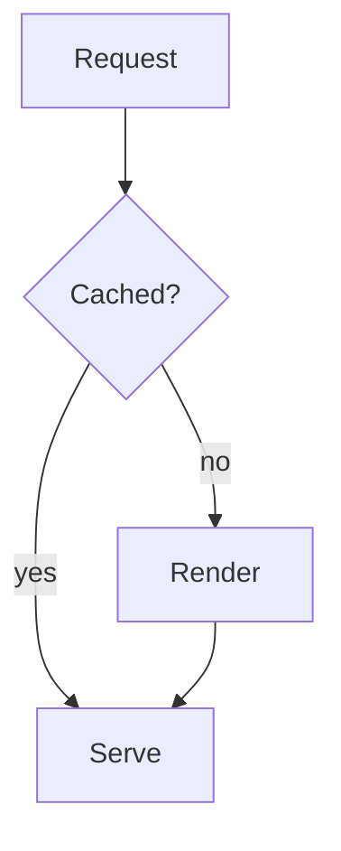

# @mdxstudio/mermaid

Mermaid diagrams for mdxstudio. Registers `<MermaidDiagram>` (also `<Mermaid>`) and
takes over ` ```mermaid ` fenced code blocks.

Mermaid itself — roughly 3 MB of grammars and layout engines — is behind a dynamic
`import()` inside the component. Registering this plugin costs a few kilobytes;
the diagram engine downloads the first time a document actually contains one.

## Install

```sh
npm install @mdxstudio/mermaid @mdxstudio/core @mdxstudio/react react
```

| Peer           | Range     |
| -------------- | --------- |
| `react`        | `^19.0.0` |
| `@mdxstudio/core` | `^0.1.0`  |

`mermaid` and `lucide-react` are ordinary dependencies — no need to install them.

## Usage

```ts
import { createRendererRegistry } from '@mdxstudio/react';
import { mermaidPlugin } from '@mdxstudio/mermaid';

export const registry = createRendererRegistry(mermaidPlugin);
```

````mdx

````

## Stylesheet

```ts
import '@mdxstudio/mermaid/styles.css';
```

Required — without it the diagram frame, header and error state are unstyled.
This is in addition to `@mdxstudio/react/styles.css`.

ESM only, with TypeScript declarations.

## License

MIT
