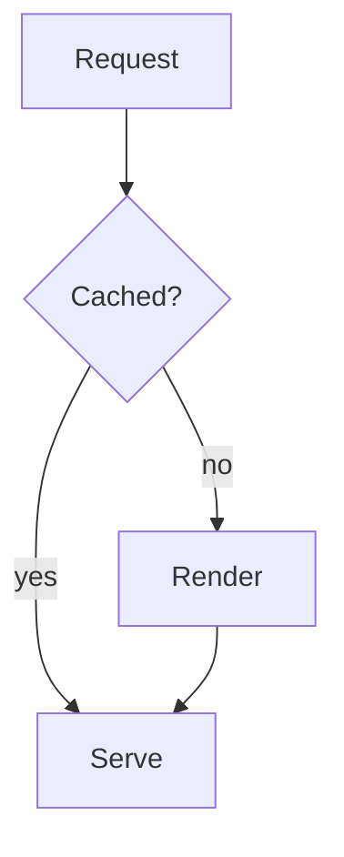

# @mdxstudio/mermaid

Mermaid diagrams for mdxstudio. Registers `<MermaidDiagram>` (also `<Mermaid>`) and
takes over ` ```mermaid ` fenced code blocks.

Mermaid itself — roughly 3 MB of grammars and layout engines — is behind a dynamic
`import()` inside the component. Registering this plugin costs a few kilobytes;
the diagram engine downloads the first time a document actually contains one.

## Install

```sh
npm install @mdxstudio/mermaid @mdxstudio/core @mdxstudio/react react
```

| Peer           | Range     |
| -------------- | --------- |
| `react`        | `^19.0.0` |
| `@mdxstudio/core` | `^0.1.0`  |

`mermaid` and `lucide-react` are ordinary dependencies — no need to install them.

## Usage

```ts
import { createRendererRegistry } from '@mdxstudio/react';
import { mermaidPlugin } from '@mdxstudio/mermaid';

export const registry = createRendererRegistry(mermaidPlugin);
```

````mdx

````

## Pan and zoom

A rendered diagram is fitted to the width it is given, which for anything large
means unreadable. Every live diagram therefore sits in a frame it can be moved
around inside, with three buttons in the bottom-right corner: zoom out, zoom in,
and reset. Reset returns to exactly the initial fit.

| Gesture | Does |
| --- | --- |
| Drag | Pans, once zoomed in. |
| Arrow keys | Pans, three times as far with `Shift`. |
| `+` / `-` / `0` | Zoom in, zoom out, reset. |
| `Ctrl`/`Cmd` + wheel | Zooms about the pointer. |
| Wheel on its own | **Scrolls the page.** The diagram never takes it. |
| Pinch | Zooms, once zoomed in. |

Zoom runs from the fitted view up to 8x. Zooming is a CSS transform on a wrapper,
so the card keeps the height it had and the document never reflows underneath the
reader; there is no pan-zoom library involved.

The controls are faint until the frame is hovered, focused or zoomed — a preview
pane is often only a few hundred pixels wide, and a solid control bar there is a
bite out of the drawing. On a touch screen, which has no hover, they stay
visible.

A diagram that failed to parse has no controls, and neither does one in an
export: `renderMode="pdf"` renders the drawing at its natural fit and nothing
else, because the exporter strips every button and a diagram frozen mid-zoom
would arrive cropped.

## Stylesheet

```ts
import '@mdxstudio/mermaid/styles.css';
```

Required — without it the diagram frame, header and error state are unstyled.
This is in addition to `@mdxstudio/react/styles.css`.

ESM only, with TypeScript declarations.

## License

MIT
