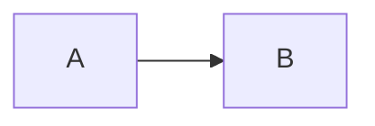
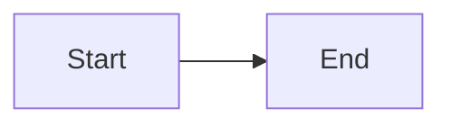

# Component catalogue

Every component below is available in a document with no import, provided the
host registered the package that ships it. Props are the real ones; anything not
listed is ignored.

Source of truth: `packages/react/src/CustomComponents.tsx` (built-ins),
`packages/mermaid/src/index.ts`, `packages/charts/src/index.ts`,
`packages/flow/src/index.ts`, `packages/tasks/src/index.ts` (plugins),
`apps/studio/src/mdxRegistry.ts` (what a default application registers).

## What a default application registers

```ts
import { createRendererRegistry } from '@mdxstudio/react';
import { mermaidPlugin } from '@mdxstudio/mermaid';
import { chartsPlugin } from '@mdxstudio/charts';
import { flowPlugin } from '@mdxstudio/flow';
import { tasksPlugin } from '@mdxstudio/tasks';

export const registry = createRendererRegistry(
  mermaidPlugin,
  chartsPlugin,
  flowPlugin,
  tasksPlugin
);
```

That is: the built-ins, plus `MermaidDiagram`, `Chart`, `FlowGraph` and
`TaskBoard`. A host that registers only `createRendererRegistry()` has the
built-ins and nothing else - `<Mermaid>` there renders an "unknown component"
notice.

## Aliases

A tag and its alias are the same component.

| Alias | Real name | From |
| --- | --- | --- |
| `Counter` | `InteractiveCounter` | `@mdxstudio/react` |
| `CustomTable` | `Table` | `@mdxstudio/react` |
| `Code` | `InlineCode` | `@mdxstudio/react` |
| `Mermaid` | `MermaidDiagram` | `@mdxstudio/mermaid` |
| `ArchitectureMap` | `FlowGraph` | `@mdxstudio/flow` |
| `Tasks` | `TaskBoard` | `@mdxstudio/tasks` |

`Table` is itself the registered name of the component whose implementation is
called `TableComponent`.

## Icons

Every `icon` prop takes a [lucide](https://lucide.dev/icons) icon name in
PascalCase - `Rocket`, `ShieldCheck`, `GitBranch`. An unrecognised name renders
a question-mark icon rather than failing.

---

## Callout

```jsx
<Callout type="warning" title="Heading">
  Body text. **Markdown works here.**
</Callout>
```

- `type` - `info` (default) · `note` · `warning` · `success` · `error`. Anything
  else falls back to `info`.
- `title` - optional; without it the body sits alone next to the icon.

Icons are fixed per type: info/`Info`, warning/`AlertTriangle`,
success/`CheckCircle2`, error/`OctagonAlert`, note/`Sparkles`.

## Card and CardGrid

```jsx
<CardGrid cols={3}>
  <Card
    title="Title"
    subtitle="Second line"
    description="Paragraph under the head"
    icon="Eye"
    badge="New"
    href="https://example.com"
  >
    Body content, markdown included.
  </Card>
</CardGrid>
```

- `CardGrid cols` - snaps to 2 (default), 3 or 4.
- `Card title` - required. `subtitle`, `description`, `icon`, `badge`, `href`
  optional. `href` makes the whole card a link that opens in a new tab.
- `description` and `children` are separate slots and both render.

## Stat and StatGrid

```jsx
<StatGrid cols={3}>
  <Stat title="Total Visitors" value="124,850" change="+18.4%" trend="up" icon="Users" />
</StatGrid>
```

- `StatGrid cols` - snaps to 2, 3 (default) or 4.
- `Stat title` and `value` required; `value` may be a string or a number.
- `change` - the delta shown beside the value.
- `trend` - `up` (default) · `down` · `neutral`, colours the change.

## Tabs and Tab

```jsx
<Tabs labels={["macOS", "Windows"]}>
  <Tab title="macOS">First panel.</Tab>
  <Tab title="Windows">Second panel.</Tab>
</Tabs>
```

Omit `labels` and `Tabs` takes each child's `title` (or `label`) prop instead.
The first tab is open on load.

**PDF note:** the exporter strips button elements, so tab labels vanish and only
the open panel's content survives. Do not put anything load-bearing in a
non-default tab of a document meant to be exported.

## Accordion

```mdx
<Accordion>
<AccordionItem title="How does parsing work?" icon="Code2">

Panels take **full markdown** - lists, fences, other components:



</AccordionItem>
<AccordionItem title="And the second?" subtitle="optional" badge="New">

Anything at all.

</AccordionItem>
</Accordion>
```

**Panels are children, and the blank lines are load-bearing.** A blank line
after the opening tag and before the closing one is what makes the content
markdown; without them it stays literal text, though the panels still group.

| Prop | On | |
| --- | --- | --- |
| `title` | `AccordionItem` | The trigger's label |
| `icon` | `AccordionItem` | A lucide name, as on `Card` |
| `subtitle`, `badge` | `AccordionItem` | Optional detail on the trigger |
| `defaultOpen` | either | On a panel, a boolean; on the accordion, an index, a title, `"all"`, `"none"`, or a list |
| `multiple` | `Accordion` | More than one panel open at once |

With nothing specified the first panel is open. `defaultOpen="none"` starts shut.

The older `items={[{ title, content }]}` form still renders, but **`content` is
a prop, so markdown inside it stays literal** - `**bold**` renders as asterisks.
Use children.

**No PDF caveat, unlike `Tabs`.** In `pdf` render mode every panel is open and
the trigger is not a button, so an accordion survives an export whole.

## Split and Pane

Two things beside each other, for a reader who has to compare them. `Tabs` shows
one variant at a time and is wrong for this - a difference you have to remember
across a click is a difference you will miss.

````mdx
<Split ratio="60/40">
<Pane title="Before" icon="Ban">

Panes take **full markdown** - fences, lists, other components, diagrams:

```ts
const x = 1;
```

</Pane>
<Pane title="After" icon="Check" badge="Typed">

```ts
const x: number = 1;
```

</Pane>
</Split>
````

**Panes are children, and the blank lines are load-bearing** - a blank line after
the opening tag and before the closing one is what makes the content markdown
rather than literal text.

| Prop | On | |
| --- | --- | --- |
| `ratio` | `Split` | `"60/40"`, `"2:1"`, `"3 1"`, `{[3, 1]}`, or a single number meaning the first pane's share. Unreadable values give equal panes; no pane goes below 10% |
| `direction` | `Split` | `row` (default) or `column` |
| `height` | `Split` | A fixed size; the panes scroll inside it |
| `title`, `icon`, `badge` | `Pane` | A one-line header above the pane |

`direction` describes **the panes**, not the divider - `row` puts them beside
each other. It deliberately does not accept `horizontal` or `vertical`, because
both words are used for both meanings; an unrecognised value falls back to `row`.
A `column` split defaults to `24rem` tall, since a divider with no definite
height has nothing to move.

More than two panes work, and each divider moves only the pair it sits between.
Dragging one lasts for the session: nothing is stored, and a reload returns to
the ratio you wrote. The divider is focusable - arrows move it 2%, with shift
10%, and Home or a double-click resets it.

Below 48rem the panes stack and the divider disappears. Two code fences side by
side in a narrow preview pane are unreadable, so do not fight this.

`Compare` is another name for `Split`.

**No PDF caveat, unlike `Tabs`.** Two panes print side by side down to about
60/40; three panes, or anything more lopsided, stack at full width under their
titles, and an untitled pane in a stacked export is numbered so it is never a
column of unlabelled content.

## Steps and Step

```jsx
<Steps>
  <Step number={1} title="Install">Run `npm install`.</Step>
  <Step number={2} title="Configure">Edit the config file.</Step>
</Steps>
```

`Step title` is required; `number` is whatever you pass (a number or a string
like `"0"` or `"a"`) - it is not auto-generated.

## Timeline

```jsx
<Timeline
  items={[
    { date: "Q1 2026", title: "Milestone", description: "What happened.", icon: "Rocket" }
  ]}
/>
```

`date`, `title` and `description` are all shown; `icon` defaults to `CircleDot`.

## Table

Ordinary markdown tables work and scroll inside their own wrapper. Use the
component when the data is better expressed as props:

```jsx
<Table
  title="Optional caption"
  headers={["Name", "Value"]}
  rows={[["alpha", 1], ["beta", 2]]}
  striped={true}
/>
```

- `rows` - array of row arrays. `data` is accepted as a fallback name when it is
  itself an array of arrays.
- `headers` - optional; omit for a headerless table.
- `striped` - default `true`.

## Inline components

```jsx
<Badge variant="emerald" icon="Check">Stable</Badge>
<Kbd>Ctrl</Kbd> + <Kbd>C</Kbd>
<InlineCode>value</InlineCode>
<ProgressBar progress={82} label="Deploying" color="emerald" />
<Counter initial={42} min={0} max={100} step={5} title="Counter" />
<Button variant="primary" icon="Play">Run</Button>
```

- `Badge variant` - `indigo` (default) · `emerald` · `rose` · `amber` · `slate`.
- `ProgressBar color` - `indigo` (default) · `emerald` · `amber` · `rose` ·
  `purple` · `cyan`. `progress` is clamped to 0-100.
- `Button variant` - `primary` (default) · `secondary` · `outline`. It flashes a
  tick when clicked; it is a demo affordance, not a link. Use a markdown link
  for anything that should navigate.
- `Counter` (alias of `InteractiveCounter`) is a demo widget - `initial`, `min`,
  `max`, `step`, `title`.

Both `Badge` and `ProgressBar` clamp an unrecognised variant back to the default
rather than failing.

## Mermaid

The fence and the component are the same thing - `@mdxstudio/mermaid` claims the
`mermaid` fence language, so the renderer mounts the diagram component instead
of syntax-highlighting the block.

````md

````

```jsx
<Mermaid chart={`flowchart LR
    A["Start"] --> B["End"]`} />
```

Prefer the fence: it needs no template literal and no brace escaping. See
[mermaid.md](mermaid.md).

## Chart

```jsx
<Chart
  type="area"
  title="Monthly growth"
  data={[{ name: 'Jan', value: 1200 }, { name: 'Feb', value: 1900 }]}
/>
```

- `type` - `line` (default) · `bar` · `area`. **There is no pie chart.**
- `dataKey` defaults to `value`, `nameKey` to `name`, `height` to `240`.
- `color` is a CSS colour string, default `#6366f1`.
- Recharts loads on mount rather than with the page, so the plot area paints a
  beat after the box does.
- Omitting `data` renders six months of placeholder data - always pass real
  data.

## FlowGraph

See [flowgraph.md](flowgraph.md).

## TaskBoard — the `tasks` fence

The fence and the component are the same thing: `@mdxstudio/tasks` claims the
`tasks` fence language, so the block renders as a plan rather than as code.
**Write the fence, not the component** — the fence needs no escaping, and it
leaves the plan as plain text that you can diff and rewrite line by line.

````md
```tasks
- [ ] AG-1: Delete the engine   needs: AG-0b, AG-6a   @me   !p1   #risk
    Remove the runner, the trade workflows and the trade machinery.
    The API must still boot and serve the frontend routes.
    - [ ] Prune the schema package
- [→] Multi-layer contours   trigger: DW-1c
- [-] Typed checklist subsystem   reason: rejected as over-engineering
```
````

One line is one item. **Indent four spaces to nest**, to any depth. There is no
epic or subtask syntax — depth is depth.

### Statuses

`[ ]` to do · `[~]` in progress · `[x]` done · `[!]` blocked · `[→]` (or `[>]`)
deferred · `[-]` canceled.

Any other marker is **not a task**: the line is kept exactly where it is, dimmed,
rather than being given a guessed status. So do not invent markers.

### Ids

`- [ ] AG-1: Delete the engine` has the id `AG-1`. **The colon is what makes it
an id.** `- [ ] Multi-layer contours` has no id, and `- [ ] Fix the parser: it
drops rows` has none either — a colon inside a sentence is a sentence. Ids are
what `needs:` resolves against, case-insensitively.

Give an item an id when something else depends on it, and not otherwise.

### Fields, after the title

| Field | Written | Inherits down? |
| --- | --- | --- |
| Assignee | `@ann` | yes |
| Label | `#risk` | yes |
| Milestone | `milestone: v1` | yes |
| Dependencies | `needs: AG-1, AG-6a` | no |
| ~~Estimate~~ | `est: 3d` | **do not write it** - see below |
| Due | `due: 2026-04-01` | no |
| Priority | `!p1`…`!p4` (`!urgent` `!high` `!med` `!low`) | no |
| Trigger | `trigger: when DW-1c lands` | no |
| Reason | `reason: rejected as over-engineered` | no |

Three rules that decide whether a line reads the way you meant:

1. **Title first, fields last.** A value stops at the next field, so words
   written after `milestone: v1` become part of the milestone.
2. **`trigger:` and `reason:` run to the end of the line.** Put them last of all;
   anything after them, sigils included, is swallowed into their text.
3. **An unknown `key: value` is not a field** — it stays in the title. Only the
   nine above are fields. This is why titles with colons survive.

A trailing markdown link is taken off before tags are read, so
`- [ ] Read it [spec](doc.mdx#ids)` is a link and `#ids` is not a label. Only
`http`, `https`, `mailto` and relative targets are linked.

### Descriptions

Indented lines that are **not** bullets, deeper than the bullet above them, are
that item's description. Blank lines separate paragraphs. Inline markdown works.
Prose is a node's description and belongs under its node — do not collect notes
at the bottom of the fence, and do not put headings inside it: structure comes
from indentation and ids.

### What you must not write

Everything below is **derived and displayed already**, so writing it by hand only
creates something to contradict:

- progress or counts on a parent (`3/7 done`) — rolled up from descendants,
  canceled work excluded from the divisor
- "blocked" or "ready" as text — read from `[!]` and from `needs:` (a dependency
  the document does not contain counts as satisfied)
- estimate totals — summed over the subtree in days and points separately, so
  put `est:` on leaves or it counts twice
- the owner of every child of an owned parent — `@`, `#` and `milestone:` flow
  down until a descendant declares its own

A parent marked `[x]` over children that are not is reported on the row as an
inconsistency and left alone. If that is not what you meant, fix the markers.

### How it reads

Children are collapsed on load, top level included, except the path down to any
`[~]`, which opens. The list starts at the head of the plan - everything in
flight plus the next few items - with `View N more` for the rest, and top-level
work that is finished, canceled or deferred sinks into a folded bucket at the
bottom. Each row copies its **verbatim source line**, which is how a reader
hands you an exact line to edit. The component never writes to the file.

That is why order matters when you write one: put the work that is next near the
top, and let finished work stay where it was rather than deleting it.

The reader can scope the board to one **epic** — a top-level item that has
children. That is the only sense in which epics exist here, so put the work that
belongs together under one top-level line and it becomes filterable for free.

---

## Expressions

Expressions are evaluated with real JavaScript semantics against the registry,
so this works:

```jsx
<StatGrid cols={3}>
  {[["Requests", "1.2M"], ["Errors", "31"], ["p99", "84ms"]].map(
    ([title, value]) => <Stat key={title} title={title} value={value} />
  )}
</StatGrid>
```

An expression that throws, or that names something the registry does not have,
warns in the console and is omitted; the document still renders.

**A host can turn this down.** `MdxRenderer` takes an `expressions` prop.
`'full'` is the default and is right for documents the user wrote. A host
rendering documents it did not write can set `'literals'`, which builds only
values the syntax spells out - strings, numbers, booleans, `null`, arrays, plain
objects and substitution-free template literals - and refuses identifiers, calls,
member access and JSX. **If the document may be rendered by such a host, keep
every expression JSON-shaped**: `data={{ nodes: [...] }}` is fine, `.map(...)` is
not.

## PDF export

A4, page breaks measured to avoid splitting diagrams, headings, tables and the
frontmatter card. It runs entirely in the browser.

- The output is a **raster image**, so its text is not selectable or searchable.
- Every `button` is stripped, so a `Tabs` block exports only its open tab -
  do not put anything load-bearing in a tab that is not the default one.
  `Accordion`, `Split` and the ` ```tasks ` board are safe: they render every
  panel, pane, description and bucket open in `pdf` mode, with no buttons to
  strip.
- Export **fails outright** if any Mermaid diagram in the document is in the
  error state, or if diagrams have not finished rendering within 10 seconds.
