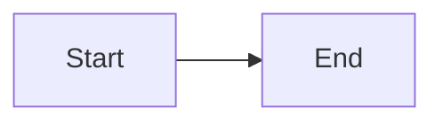

# Component catalogue

Every component below is available in a document with no import, provided the
host registered the package that ships it. Props are the real ones; anything not
listed is ignored.

Source of truth: `packages/react/src/CustomComponents.tsx` (built-ins),
`packages/mermaid/src/index.ts`, `packages/charts/src/index.ts`,
`packages/flow/src/index.ts` (plugins), `apps/studio/src/mdxRegistry.ts` (what a
default application registers).

## What a default application registers

```ts
import { createRendererRegistry } from '@mdxstudio/react';
import { mermaidPlugin } from '@mdxstudio/mermaid';
import { chartsPlugin } from '@mdxstudio/charts';
import { flowPlugin } from '@mdxstudio/flow';

export const registry = createRendererRegistry(mermaidPlugin, chartsPlugin, flowPlugin);
```

That is: the built-ins, plus `MermaidDiagram`, `Chart` and `FlowGraph`. A host
that registers only `createRendererRegistry()` has the built-ins and nothing
else - `<Mermaid>` there renders an "unknown component" notice.

## Aliases

A tag and its alias are the same component.

| Alias | Real name | From |
| --- | --- | --- |
| `Counter` | `InteractiveCounter` | `@mdxstudio/react` |
| `CustomTable` | `Table` | `@mdxstudio/react` |
| `Code` | `InlineCode` | `@mdxstudio/react` |
| `Mermaid` | `MermaidDiagram` | `@mdxstudio/mermaid` |
| `ArchitectureMap` | `FlowGraph` | `@mdxstudio/flow` |

`Table` is itself the registered name of the component whose implementation is
called `TableComponent`.

## Icons

Every `icon` prop takes a [lucide](https://lucide.dev/icons) icon name in
PascalCase - `Rocket`, `ShieldCheck`, `GitBranch`. An unrecognised name renders
a question-mark icon rather than failing.

---

## Callout

```jsx
<Callout type="warning" title="Heading">
  Body text. **Markdown works here.**
</Callout>
```

- `type` - `info` (default) · `note` · `warning` · `success` · `error`. Anything
  else falls back to `info`.
- `title` - optional; without it the body sits alone next to the icon.

Icons are fixed per type: info/`Info`, warning/`AlertTriangle`,
success/`CheckCircle2`, error/`OctagonAlert`, note/`Sparkles`.

## Card and CardGrid

```jsx
<CardGrid cols={3}>
  <Card
    title="Title"
    subtitle="Second line"
    description="Paragraph under the head"
    icon="Eye"
    badge="New"
    href="https://example.com"
  >
    Body content, markdown included.
  </Card>
</CardGrid>
```

- `CardGrid cols` - snaps to 2 (default), 3 or 4.
- `Card title` - required. `subtitle`, `description`, `icon`, `badge`, `href`
  optional. `href` makes the whole card a link that opens in a new tab.
- `description` and `children` are separate slots and both render.

## Stat and StatGrid

```jsx
<StatGrid cols={3}>
  <Stat title="Total Visitors" value="124,850" change="+18.4%" trend="up" icon="Users" />
</StatGrid>
```

- `StatGrid cols` - snaps to 2, 3 (default) or 4.
- `Stat title` and `value` required; `value` may be a string or a number.
- `change` - the delta shown beside the value.
- `trend` - `up` (default) · `down` · `neutral`, colours the change.

## Tabs and Tab

```jsx
<Tabs labels={["macOS", "Windows"]}>
  <Tab title="macOS">First panel.</Tab>
  <Tab title="Windows">Second panel.</Tab>
</Tabs>
```

Omit `labels` and `Tabs` takes each child's `title` (or `label`) prop instead.
The first tab is open on load.

**PDF note:** the exporter strips button elements, so tab labels vanish and only
the open panel's content survives. Do not put anything load-bearing in a
non-default tab of a document meant to be exported.

## Accordion

```jsx
<Accordion
  items={[
    { title: "Question?", content: "Answer." },
    { title: "Another?", content: "Also an answer." }
  ]}
/>
```

`items` is a prop, not children. `content` is a string or a node. The first item
is open on load. Same PDF caveat as `Tabs`.

## Steps and Step

```jsx
<Steps>
  <Step number={1} title="Install">Run `npm install`.</Step>
  <Step number={2} title="Configure">Edit the config file.</Step>
</Steps>
```

`Step title` is required; `number` is whatever you pass (a number or a string
like `"0"` or `"a"`) - it is not auto-generated.

## Timeline

```jsx
<Timeline
  items={[
    { date: "Q1 2026", title: "Milestone", description: "What happened.", icon: "Rocket" }
  ]}
/>
```

`date`, `title` and `description` are all shown; `icon` defaults to `CircleDot`.

## Table

Ordinary markdown tables work and scroll inside their own wrapper. Use the
component when the data is better expressed as props:

```jsx
<Table
  title="Optional caption"
  headers={["Name", "Value"]}
  rows={[["alpha", 1], ["beta", 2]]}
  striped={true}
/>
```

- `rows` - array of row arrays. `data` is accepted as a fallback name when it is
  itself an array of arrays.
- `headers` - optional; omit for a headerless table.
- `striped` - default `true`.

## Inline components

```jsx
<Badge variant="emerald" icon="Check">Stable</Badge>
<Kbd>Ctrl</Kbd> + <Kbd>C</Kbd>
<InlineCode>value</InlineCode>
<ProgressBar progress={82} label="Deploying" color="emerald" />
<Counter initial={42} min={0} max={100} step={5} title="Counter" />
<Button variant="primary" icon="Play">Run</Button>
```

- `Badge variant` - `indigo` (default) · `emerald` · `rose` · `amber` · `slate`.
- `ProgressBar color` - `indigo` (default) · `emerald` · `amber` · `rose` ·
  `purple` · `cyan`. `progress` is clamped to 0-100.
- `Button variant` - `primary` (default) · `secondary` · `outline`. It flashes a
  tick when clicked; it is a demo affordance, not a link. Use a markdown link
  for anything that should navigate.
- `Counter` (alias of `InteractiveCounter`) is a demo widget - `initial`, `min`,
  `max`, `step`, `title`.

Both `Badge` and `ProgressBar` clamp an unrecognised variant back to the default
rather than failing.

## Mermaid

The fence and the component are the same thing - `@mdxstudio/mermaid` claims the
`mermaid` fence language, so the renderer mounts the diagram component instead
of syntax-highlighting the block.

````md

````

```jsx
<Mermaid chart={`flowchart LR
    A["Start"] --> B["End"]`} />
```

Prefer the fence: it needs no template literal and no brace escaping. See
[mermaid.md](mermaid.md).

## Chart

```jsx
<Chart
  type="area"
  title="Monthly growth"
  data={[{ name: 'Jan', value: 1200 }, { name: 'Feb', value: 1900 }]}
/>
```

- `type` - `line` (default) · `bar` · `area`. **There is no pie chart.**
- `dataKey` defaults to `value`, `nameKey` to `name`, `height` to `240`.
- `color` is a CSS colour string, default `#6366f1`.
- Recharts loads on mount rather than with the page, so the plot area paints a
  beat after the box does.
- Omitting `data` renders six months of placeholder data - always pass real
  data.

## FlowGraph

See [flowgraph.md](flowgraph.md).

---

## Expressions

Expressions are evaluated with real JavaScript semantics against the registry,
so this works:

```jsx
<StatGrid cols={3}>
  {[["Requests", "1.2M"], ["Errors", "31"], ["p99", "84ms"]].map(
    ([title, value]) => <Stat key={title} title={title} value={value} />
  )}
</StatGrid>
```

An expression that throws, or that names something the registry does not have,
warns in the console and is omitted; the document still renders.

**A host can turn this down.** `MdxRenderer` takes an `expressions` prop.
`'full'` is the default and is right for documents the user wrote. A host
rendering documents it did not write can set `'literals'`, which builds only
values the syntax spells out - strings, numbers, booleans, `null`, arrays, plain
objects and substitution-free template literals - and refuses identifiers, calls,
member access and JSX. **If the document may be rendered by such a host, keep
every expression JSON-shaped**: `data={{ nodes: [...] }}` is fine, `.map(...)` is
not.

## PDF export

A4, page breaks measured to avoid splitting diagrams, headings, tables and the
frontmatter card. It runs entirely in the browser.

- The output is a **raster image**, so its text is not selectable or searchable.
- Every `button` is stripped, so `Tabs` labels and `Accordion` questions do not
  appear.
- Export **fails outright** if any Mermaid diagram in the document is in the
  error state, or if diagrams have not finished rendering within 10 seconds.
