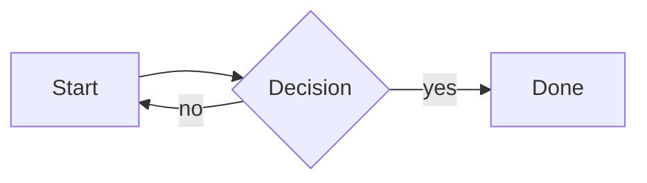
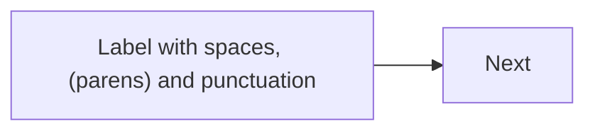
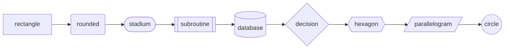
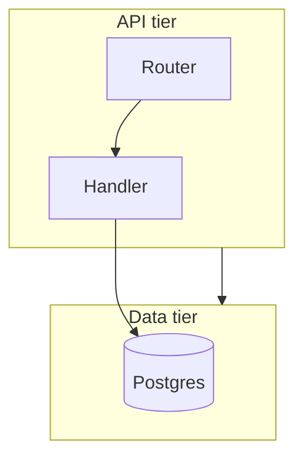
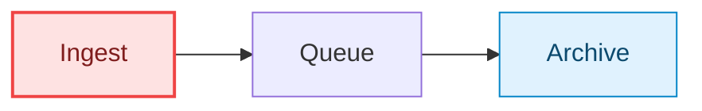
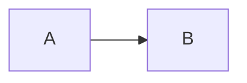

# Mermaid diagrams

Written as a fenced ` ```mermaid ` block, or as `<Mermaid chart={\`...\`} />`.
**Prefer the fence** - it needs no template literal, and braces inside a fence
are literal, so `%%{init}%%` and node labels containing `{}` cannot be eaten by
the MDX expression parser.

````md

````

Diagram types below were verified against **mermaid 11.16.1**, the version
`@mdxstudio/mermaid` depends on. The first word of the diagram is what selects
the type.

## Application-specific facts

These are true of this renderer, not of Mermaid in general.

- **A failed diagram does not break the document.** Invalid syntax renders an
  inline error card with the parser's message and the raw source in a `details`
  element. The rest of the page is unaffected. An errored diagram has no
  controls.
- **Diagrams pan and zoom.** Three buttons sit bottom-right - zoom out, zoom in,
  reset. Dragging pans, arrow keys pan, `+` and `-` zoom, `0` resets, and
  <kbd>Ctrl</kbd>/<kbd>Cmd</kbd>+wheel zooms about the pointer. Once zoomed in,
  pinch works too. Zoom runs from the fitted view to 8x and is a CSS transform,
  so the card's height never changes.
- **A plain wheel scrolls the page.** The diagram never takes it, so a reader
  scrolling past a large diagram is never trapped in it.
- The controls are faint until hovered, focused or zoomed, and always visible on
  a touch device. `data-mermaid-zoom` on the wrapper carries the current
  percentage in live mode.
- **PDF export renders no controls and the diagram at its natural fit.** What a
  reader zoomed to is not carried into the export.

  Practical consequence when writing: a diagram too dense to read at page width
  is still too dense in the export. Pan and zoom help a reader on screen; they
  do not rescue a diagram that should have been split into two.
- **Diagrams expose `data-render-state`** on their wrapper element:
  `rendering` → `ready` | `error`. Tests and export code key off it. An errored
  diagram also carries `data-mermaid-error="true"` and `data-error-message`.
- **PDF export refuses a document containing a failed diagram.** The exporter
  waits for every diagram to reach `ready` and throws
  `Cannot export PDF. Mermaid diagram error: ...` if any is in `error`, or times
  out after 10 seconds. Fix every diagram before exporting.
- **Theme is chosen for you** - Mermaid's `neutral` theme in light mode, `dark`
  in dark mode, with the palette overridden to match the document. Do not set
  `theme` in `%%{init}%%`; it will be overwritten.
- **PDF renders SVG-only labels** (`htmlLabels: false`) so the canvas is not
  tainted. Labels that rely on HTML formatting will look different in an export.
- **Mermaid is ~3 MB** and is imported on first use, not with the page. One
  diagram costs the same download as ten.

## Choosing a type

### Everyday

| Type | First word | Good for |
| --- | --- | --- |
| Flowchart | `flowchart` / `graph` | Anything with boxes and arrows. The default choice. |
| Sequence | `sequenceDiagram` | Messages between participants over time; request/response, protocols, handshakes. |
| Class | `classDiagram` | Types, fields, methods and their relationships. |
| State | `stateDiagram-v2` | A machine: states, transitions, guards. Use when the *same* thing changes mode. |
| Entity relationship | `erDiagram` | Database tables and cardinality. |
| Git graph | `gitGraph` | Branching and merge strategy. |
| Gantt | `gantt` | Dated work with durations and dependencies. |
| Pie | `pie` | One set of parts of one whole. Rarely worth it over a sentence. |
| Mindmap | `mindmap` | Hierarchical brainstorm; indentation is the structure. |
| Timeline | `timeline` | Dated events with no dependencies. |
| User journey | `journey` | Steps a person takes, scored by how they feel about each. |
| Quadrant | `quadrantChart` | Items placed on two axes - effort/impact, risk/reward. |
| Requirement | `requirementDiagram` | Formal requirements and what satisfies them. |
| Kanban | `kanban` | Board columns and cards. |
| Info | `info` | Prints the Mermaid version. A smoke test, not a diagram. |

### Upstream-beta or experimental

These are supported but their syntax can change between Mermaid minors, and
several *require* the `-beta` suffix in the first word.

| Type | First word | Good for |
| --- | --- | --- |
| C4 | `C4Context`, `C4Container`, `C4Component`, `C4Dynamic`, `C4Deployment` | C4-model architecture. Marked experimental upstream. |
| Architecture | `architecture-beta` | Cloud/service topology with groups, icons and junctions. |
| Block | `block-beta` | Fixed grid layouts; memory maps, hardware blocks. |
| Sankey | `sankey-beta` | Flow volumes that split and merge. Needs CSV-shaped input. |
| XY chart | `xychart-beta` | Bar/line chart from literal numbers. |
| Packet | `packet-beta` | Byte/bit layout of a wire format. |
| Radar | `radar-beta` | Several metrics compared on one shape. |
| Treemap | `treemap` | Nested proportions by area. |
| Tree view | `treeView-beta` | A file/hierarchy tree. |
| Venn | `venn-beta` | Set overlaps. |
| Swimlane | `swimlane-beta` | A flow split into lanes by owner. |
| Event modeling | `eventmodeling` | Commands, events and read models over a timeline. |
| Ishikawa | `ishikawa-beta` (or `ishikawa`) | Cause-and-effect fishbone for a post-mortem. |
| Cynefin | `cynefin-beta` | Sorting problems into clear/complicated/complex/chaotic. |
| Wardley | `wardley-beta` | Value-chain maps against evolution. |
| Railroad | `railroad-beta`, `railroad-abnf-beta`, `railroad-ebnf-beta`, `railroad-peg-beta` | Grammar syntax diagrams. |

`zenuml` is **not** available - it ships as a separate `@mermaid-js/mermaid-zenuml`
addon that this package does not bundle.

Prefer an everyday type when one will do. A beta diagram that stops parsing
after a dependency bump takes a PDF export down with it.

## Syntax worth knowing

### Quote every label



Unquoted labels break on parentheses, commas and colons. Quoting always is the
cheapest habit. For markdown inside a label use backtick-quoting: `A["`**bold**`"]`.

### Direction and edges

`flowchart TD` (top-down), `LR` (left-right), also `RL`, `BT`.

```mermaid
flowchart TD
  A --> B          %% arrow
  A --- B          %% open link
  A -.-> B         %% dotted
  A ==> B          %% thick
  A -->|label| B   %% labelled
  A --o B          %% circle end
  A --x B          %% cross end
```

### Node shapes



Mermaid 11 also accepts the general form
`id@{ shape: rounded, label: "text" }`, which unlocks the full shape catalogue.

### subgraph

Groups nodes into a labelled box. Edges may cross subgraph boundaries, and a
subgraph id can itself be an edge endpoint.



Give every subgraph an explicit `id["Title"]` - the auto-generated id is the
title text, which breaks the moment the title contains punctuation.

### classDef

Reusable styling, far better than repeating `style` lines.



Attach with `:::name` inline, or `class A,B,C name;` for several at once.
`classDef default ...` restyles everything unclassed. Note that the light and
dark themes differ, so hard-coded colours must be legible on both - prefer
strong strokes over strong fills.

### %%{init}%%

A directive on the **first line** that configures just this diagram.



Useful keys: `flowchart.curve` (`linear`, `basis`, `stepAfter`),
`flowchart.nodeSpacing` / `rankSpacing`, `flowchart.defaultRenderer`
(`dagre` or `elk` for large graphs), `sequence.mirrorActors`,
`gantt.axisFormat`, `look: "handDrawn"`. Do **not** set `theme` - the renderer
overrides it per document theme.

`%%` on its own starts a comment line.

### Accessibility


Worth adding to any diagram that carries real information.

## Pitfalls

- **Indentation is not syntax** in flowcharts, but it *is* in `mindmap` and
  `timeline`. Keep those consistent.
- **A `;` ends a statement.** A stray one mid-label breaks the parse.
- **Node ids cannot contain spaces.** `my node["Label"]` fails; use
  `my_node["Label"]`.
- **`end` is reserved** - it closes a `subgraph`. A node called `end` breaks the
  diagram; write `End` or `finish`.
- **Very wide graphs** overflow rather than wrapping. Switch `TD`↔`LR`, split
  into two diagrams, or add `%%{init: {"flowchart": {"defaultRenderer": "elk"}}}%%`.
- **One diagram, one idea.** If a flowchart needs three colours of arrow to be
  legible, it is three diagrams - or a `FlowGraph` (see
  [flowgraph.md](flowgraph.md)).
